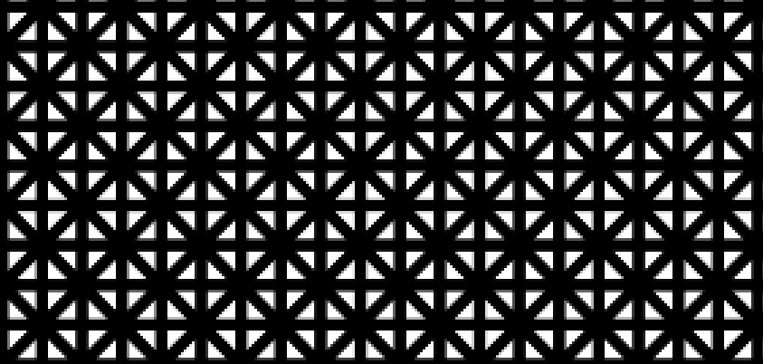
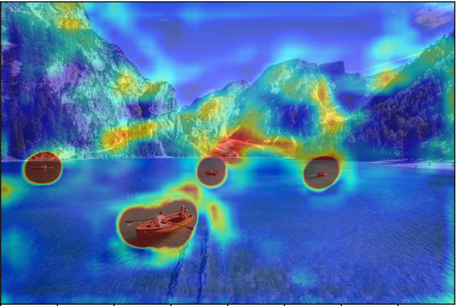
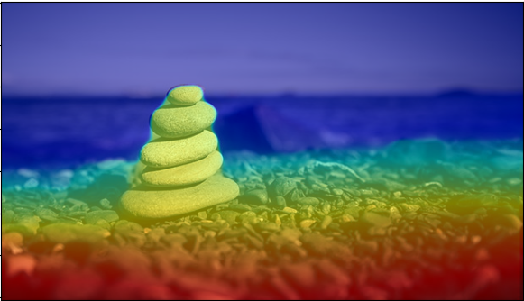
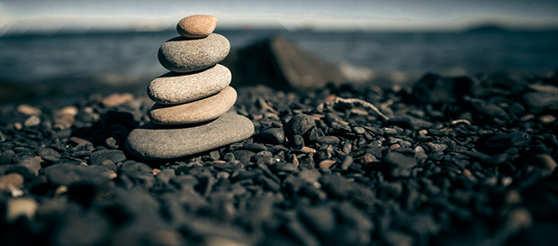
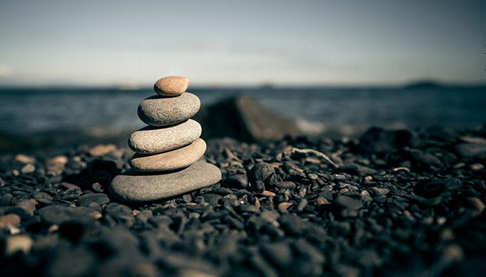

# Seam carving Vectorization project
## Provided test data
There are some test images provided in the `images` folder, if you want to add your own test image, please upload the test image in this folder.
## Run the project
Run `python3 main.py <--i image> <--s n (ie:20)> <-g true/false> <-m vgg/MiDaS>` to run the project.
For example, you can run `python3 .\main.py -i cat.png --s 20` to remove 20 seams on the `cat.png` in the `images` folder
, or, you can simply run `main.py` to run the default settings, `-g` option is used for ploting grid, this can take very long for large images, 
default false, `-m` option is used for choosing which CNN to use for seam carving, `vgg` to use vgg and GradCam as the guide,
 `MiDaS` to use depth map as guide, default `vgg`. Outputs are saved in the `output` folder.

## Features
### The progress of seam carving visualized
When you run the project, you can see the progress of the seam carving process as the image gets smaller and smaller. The seams
are marked as black in the image. The intermediate result(50 seams per save) are also saved during the process.
### Carve in both vertical and horizontal orientations
The program chooses the seam with the lowest energy in both vertical and horizontal orientation. You can see this clearly
in the Progress shown.
### Strategy for triangles orientation

### Additional CNN for depth map
This project can also use depth map as the mask for input. This project used the open-source MiDaS model to compute the depth map of the image and use that as the 
mask for seam-carving. To use MiDaS depth map,simply add `-m MiDaS` to the command line.

## Sample output
### Vgg GradCam
Run `python3 main.py -s 200`
#### Example process
* 1.Original(800 * 532) 
* 2.Gradcam painting(800 * 532)  
* 3.After 200 seams removed(699 * 433)
<table>
  <tr>
    <td></td>
    <td></td>
    <td></td>
  </tr>
</table>

#### vectorized image

### MiDaS Depth Map
Run `python3 main.py -i stone.png -s 80 -m MiDaS
`
#### Example process
* 1.Original(620 * 354) 
* 2.Depth map painting (620 * 354)  
* 3.After 80 seams removed(620 * 273)
<table>
  <tr>
    <td></td>
    <td></td>
    <td></td>
  </tr>
</table>

#### vectorized image
